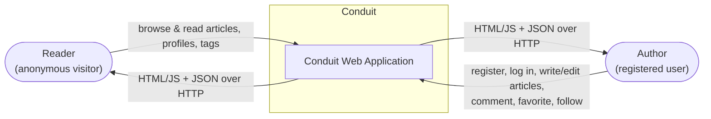
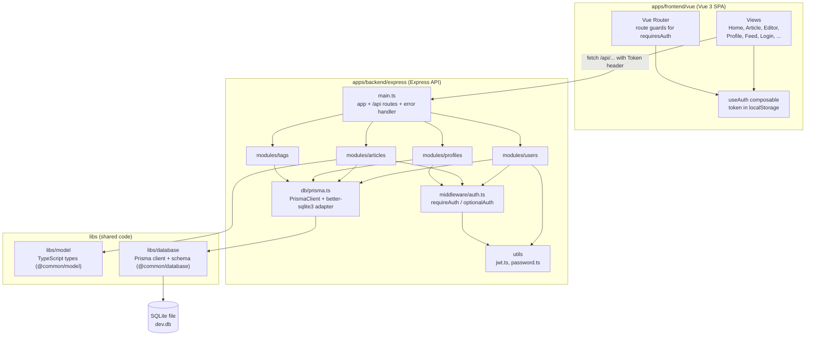
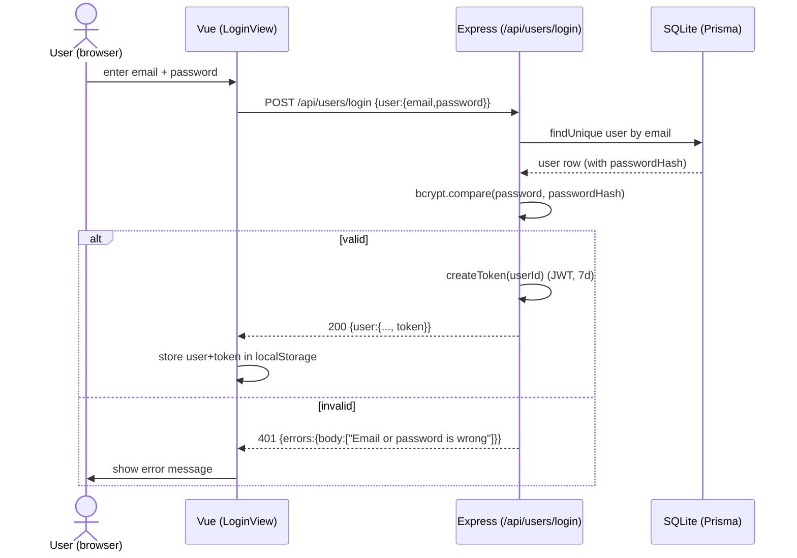
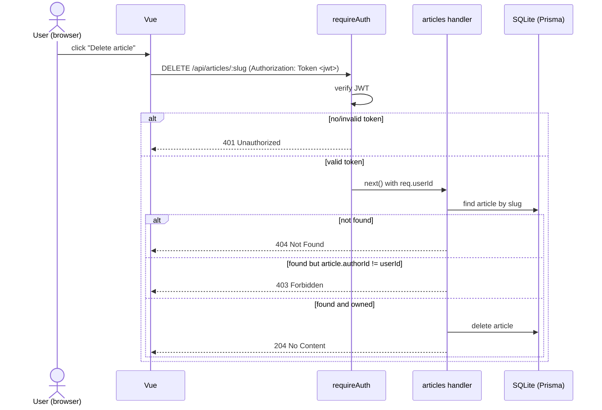
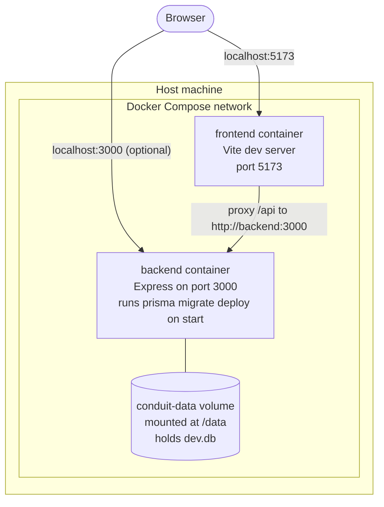

# Architecture

This document describes the architecture of the Conduit project. The diagrams
follow the views taught in the course (arc42 style): scope & context, building
block, runtime, and infrastructure. They describe the system as it is actually
implemented in this repository, not an idealized version.

## Overview

Conduit is a small article/blogging application (a "RealWorld"-style app). It
consists of:

- a **Vue 3** single-page frontend (`apps/frontend/vue`),
- an **Express + TypeScript** REST backend (`apps/backend/express`),
- a **SQLite** database accessed through **Prisma** (`libs/database/sqlite`),
- shared **TypeScript models** (`libs/model`).

The whole system is a pnpm monorepo and can be started with `docker compose up`.
The REST contract is defined in [`openapi.yaml`](./openapi.yaml).

---

## 1. Scope & Context View (Kontextabgrenzungssicht)

The system as a black box, with the people and systems around it.

- **Actors**: anonymous readers and registered authors. There is no separate
  admin role.
- **External systems**: none. The app is self-contained and stores everything in
  its own SQLite database. This keeps the project simple and reproducible.
- **Interface**: a browser talking HTTP to the frontend, and the frontend
  talking JSON to the backend REST API under `/api`.

---

## 2. Building Block View (Bausteinsicht)

This opens the black box and shows the internal components and how they depend
on each other. It mirrors the real folder structure.

### Component responsibilities

| Component | Responsibility |
| --- | --- |
| `main.ts` | Creates the Express app, parses JSON bodies, mounts the routers under `/api`, and registers the global error handler. |
| `modules/*` | One router per resource. Each handler is the HTTP/API layer **and** the business logic for that resource (controller + service combined, which is appropriate for a project of this size). |
| `middleware/auth.ts` | `requireAuth` rejects requests without a valid token (401); `optionalAuth` attaches the user if a token is present but still allows anonymous access. |
| `utils/jwt.ts` | Signs and verifies JWTs. |
| `utils/password.ts` | Hashes and verifies passwords with bcrypt. |
| `db/prisma.ts` | Single Prisma client instance, configured with the better-sqlite3 adapter and the `DATABASE_URL`. |
| `libs/model` | Shared response types (`Article`, `Comment`, `Profile`, `User`), imported by the backend via the `@common/model` path alias. |
| `libs/database` | Prisma schema, migrations, and the generated client, imported via `@common/database`. |

The `@common/model` and `@common/database` path aliases are configured in the
root `tsconfig.json`. This is the same "shared code in `/libs`" idea shown in the
course reference repository.

---

## 3. Runtime View (Laufzeitsicht)

### 3.1 Login

### 3.2 Authenticated + authorized request (delete own article)

This is the flow that shows how authorization protects ownership-sensitive
actions.

The key point for the defense: authentication (is the token valid?) is handled by
the `requireAuth` middleware and returns **401**, while authorization (does this
user own the resource?) is checked inside the handler and returns **403**.

---

## 4. Infrastructure View (Infrastruktursicht)

How the system is deployed with Docker Compose.

- **Two containers**: `frontend` and `backend`, on the default Compose network.
- **Service-name networking**: the frontend proxies `/api` to
  `http://backend:3000` (service name `backend`, **not** `localhost`), which is
  required for container-to-container communication.
- **Ports**: `5173` (frontend) and `3000` (backend) are mapped to the host.
- **Volume**: `conduit-data` is mounted at `/data` and stores the SQLite file, so
  data survives container restarts.
- **Startup order**: the backend has a healthcheck on `/api/health`; the frontend
  uses `depends_on: condition: service_healthy`, so it only starts once the
  backend is ready. The backend runs `prisma migrate deploy` before starting, so
  the schema always exists.
- **Secrets**: `JWT_SECRET` is a documented local demo default in
  `docker-compose.yml`. For a real deployment it would come from a secret/env
  store, not from version control.

---

## Notable design decisions

- **Express instead of NestJS.** The course allows any choice inside the
  TypeScript universe as long as the OpenAPI spec is followed. Express was chosen
  for its small, explicit surface: routers map directly to the spec and there is
  little framework "magic" to explain. The trade-off is that there is no built-in
  dependency injection or module system, and controller/service code lives
  together per module. See the README for the full rationale and consequences.
- **Authorization with middleware (not guards).** NestJS guards were not used
  because the project does not use NestJS. The equivalent here is Express
  middleware (`requireAuth` / `optionalAuth`), which attaches to exactly the
  routes that need it.
- **SQLite via Prisma.** A single-file database keeps the project reproducible
  and easy to start in Docker; Prisma gives a typed client and migrations.
- **Combined controller/service per module.** For a project of this size, a
  separate service layer would add indirection without real benefit. If the
  project grew, the business logic in each `*.controller.ts` would be the natural
  thing to extract into a service.
