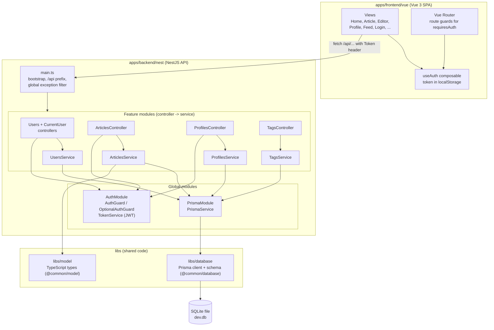
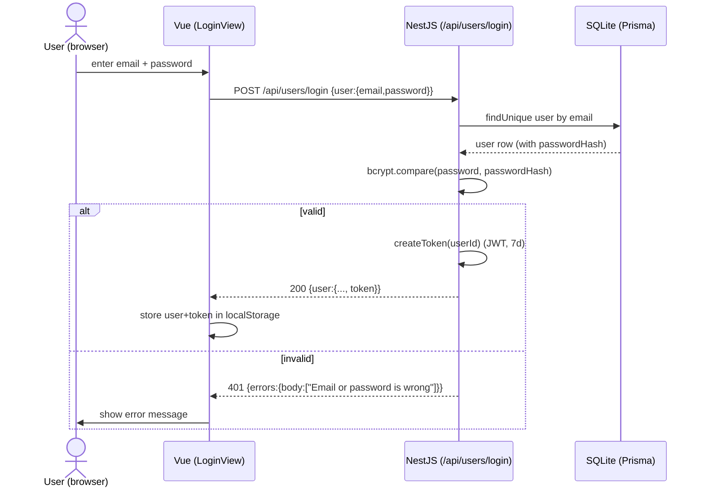
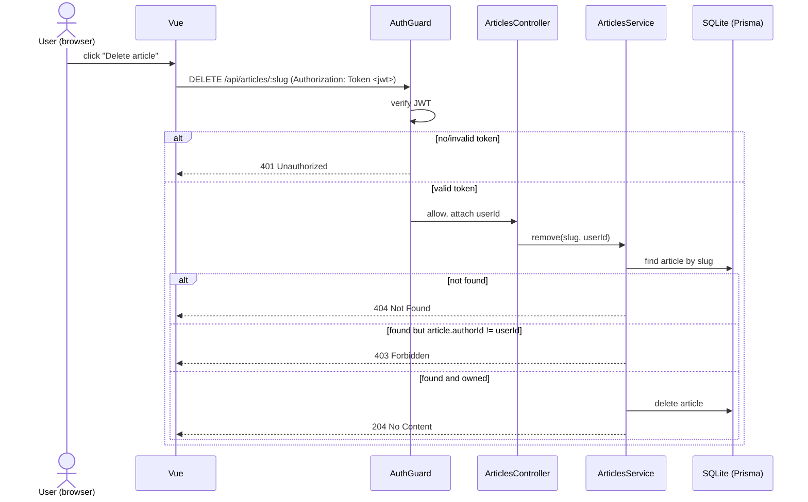

# Architecture

This document describes the architecture of the Conduit project. The diagrams
follow the views taught in the course (arc42 style): scope & context, building
block, runtime, and infrastructure. They describe the system as it is actually
implemented in this repository, not an idealized version.

## Overview

Conduit is a small article/blogging application (a "RealWorld"-style app). It
consists of:

- a **Vue 3** single-page frontend (`apps/frontend/vue`),
- a **NestJS + TypeScript** REST backend (`apps/backend/nest`),
- a **SQLite** database accessed through **Prisma** (`libs/database/sqlite`),
- shared **TypeScript models** (`libs/model`).

The whole system is a pnpm monorepo and can be started with `docker compose up`.
The REST contract is defined in [`openapi.yaml`](./openapi.yaml).

---

## 1. Scope & Context View (Kontextabgrenzungssicht)

The system as a black box, with the people and systems around it.

- **Actors**: anonymous readers and registered authors. There is no separate
  admin role.
- **Required external systems**: none. The app is self-contained and stores
  everything in its own SQLite database. The optional demo seed uses DiceBear
  image URLs for mock avatars; if those images are unavailable, the Vue
  component falls back to local initials, so core functionality remains
  reproducible.
- **Interface**: a browser talking HTTP to the frontend, and the frontend
  talking JSON to the backend REST API under `/api`.

---

## 2. Building Block View (Bausteinsicht)

This opens the black box and shows the internal components and how they depend
on each other. It mirrors the real folder structure.

### Component responsibilities

| Component | Responsibility |
| --- | --- |
| `main.ts` | Bootstraps the Nest app, sets the global `/api` prefix, and registers the global exception filter. |
| Feature modules (`users`, `profiles`, `articles`, `tags`) | Each module has a **controller** (HTTP layer: routing, status codes, guards) and a **service** (business logic + validation). |
| `common/auth` | `AuthGuard` rejects requests without a valid token (401); `OptionalAuthGuard` attaches the user if a token is present but still allows anonymous access; `TokenService` signs/verifies JWTs; `password.ts` hashes/verifies passwords with bcrypt; `@CurrentUser()` exposes the user id to controllers. |
| `common/all-exceptions.filter.ts` | Normalizes every error to the `{ errors: { body } }` shape and logs unexpected errors (the 500 fallback). |
| `PrismaService` / `PrismaModule` | A single Prisma client (extends `PrismaClient`) configured with the better-sqlite3 adapter and `DATABASE_URL`; connects on `onModuleInit`. Provided globally. |
| `libs/model` | Shared response types (`Article`, `Comment`, `Profile`, `User`), imported by the backend via the `@common/model` path alias. |
| `libs/database` | Prisma schema, migrations, and the generated client, imported via `@common/database`. |

The `@common/model` and `@common/database` path aliases are configured in the
root `tsconfig.json`. This is the same "shared code in `/libs`" idea shown in the
course reference repository.

---

## 3. Runtime View (Laufzeitsicht)

### 3.1 Login

### 3.2 Authenticated + authorized request (delete own article)

This is the flow that shows how authorization protects ownership-sensitive
actions.

The key point for the defense: authentication (is the token valid?) is handled by
the `AuthGuard` and returns **401**, while authorization (does this user own the
resource?) is checked inside the service and returns **403**.

---

## 4. Infrastructure View (Infrastruktursicht)

How the system is deployed with Docker Compose.

- **Two containers**: `frontend` and `backend`, on the default Compose network.
- **Service-name networking**: the frontend proxies `/api` to
  `http://backend:3000` (service name `backend`, **not** `localhost`), which is
  required for container-to-container communication.
- **Ports**: `5173` (frontend) and `3000` (backend) are mapped to the host.
- **Volume**: `conduit-data` is mounted at `/data` and stores the SQLite file, so
  data survives container restarts.
- **Startup order**: the backend has a healthcheck on `/api/health`; the frontend
  uses `depends_on: condition: service_healthy`, so it only starts once the
  backend is ready. The backend runs `prisma migrate deploy` before starting, so
  the schema always exists.
- **Secrets**: `JWT_SECRET` is a documented local demo default in
  `docker-compose.yml`. For a real deployment it would come from a secret/env
  store, not from version control.

---

## Notable design decisions

- **NestJS.** The backend uses NestJS to stay in the NestJS/TypeScript universe.
  Each resource is a module with a controller (HTTP layer) and a service (business
  logic); the DI container wires them together. This is more structure than a bare
  router framework, but it makes responsibilities explicit and is easy to explain.
- **Authorization with guards.** `AuthGuard` / `OptionalAuthGuard` are used
  instead of middleware because guards integrate with Nest's execution context and
  attach declaratively (`@UseGuards`) to exactly the routes that need them, keeping
  the controller/service separation clean.
- **Controller + service per module.** Controllers stay thin and only deal with
  HTTP concerns (routing, status codes, guards, reading the body); the services
  hold the validation and database logic. Validation is explicit in the services
  (rather than DTO decorators) so the responses match the OpenAPI error contract
  exactly.
- **SQLite via Prisma.** A single-file database keeps the project reproducible
  and easy to start in Docker; Prisma gives a typed client and migrations. The
  connection lives in a global `PrismaService` that connects on `onModuleInit`.
- **Runtime via SWC.** The app runs from TypeScript source through
  `@swc-node/register`, because the Prisma 7 client is ESM (uses `import.meta`) and
  NestJS DI needs decorator metadata — SWC supports both. `pnpm build` type-checks
  with `tsc`.
