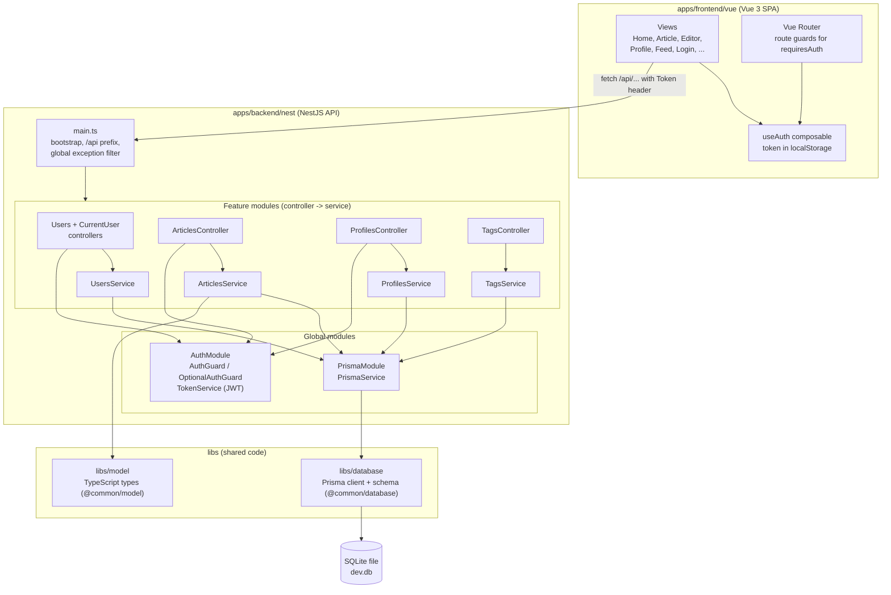
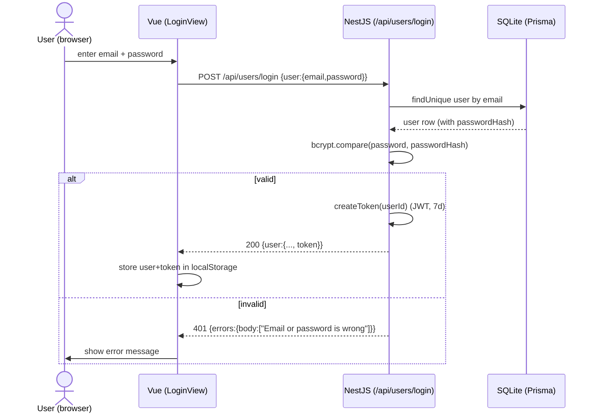
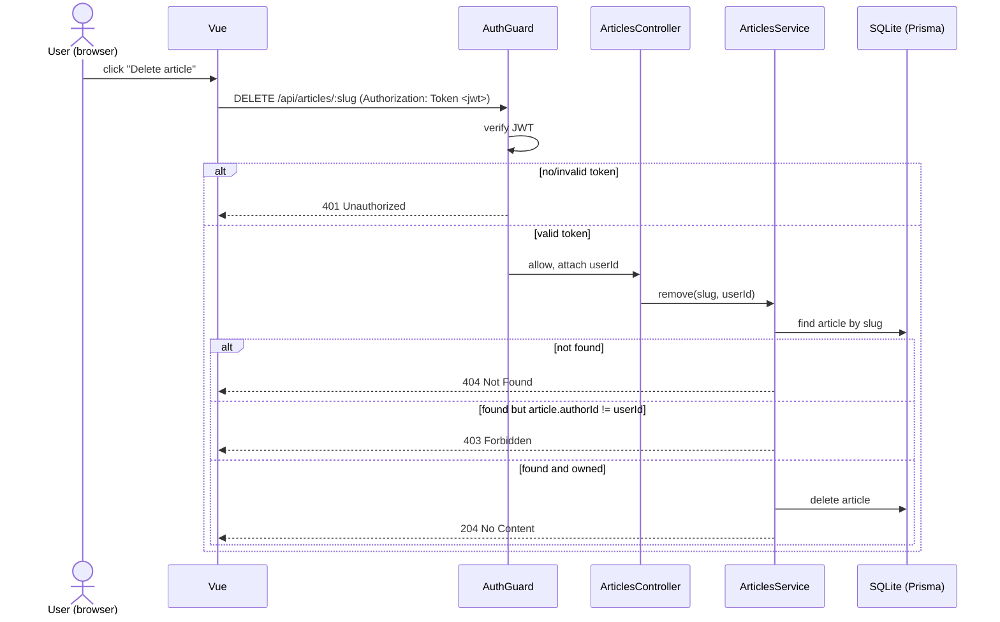

# Architecture

This document explains how we structured Conduit. It contains the context, building block, runtime, and infrastructure views for our application.

## System overview

We split Conduit into the following parts:

- a **Vue 3** single-page frontend in `apps/frontend/vue`
- a **NestJS and TypeScript** REST backend in `apps/backend/nest`
- a **SQLite** database accessed through **Prisma** in `libs/database/sqlite`
- shared **TypeScript models** in `libs/model`

We keep the code in a pnpm monorepo and start the application with `docker compose up`. [`openapi.yaml`](./openapi.yaml) defines the REST contract.

## 1. Scope and context view (Kontextabgrenzungssicht)

This view shows the actors and external interfaces.

- **Actors**: We distinguish between anonymous readers and registered authors. We do not have an administrator role.
- **External systems**: The application stores its data in its own SQLite database. The sample data uses DiceBear image URLs for avatars, but the frontend displays initials when an image is unavailable.
- **Interface**: The browser loads the Vue frontend over HTTP. The frontend exchanges JSON with the REST API under `/api`.

## 2. Building block view (Bausteinsicht)

This view shows the main application modules and their dependencies.

### Component responsibilities

| Component | Responsibility |
| --- | --- |
| `main.ts` | Bootstraps the Nest app, sets the global `/api` prefix, and registers the global exception filter. |
| Feature modules (`users`, `profiles`, `articles`, `tags`) | Each module has a **controller** (HTTP layer: routing, status codes, guards) and a **service** (business logic + validation). |
| `common/auth` | `AuthGuard` rejects requests without a valid token (401); `OptionalAuthGuard` attaches the user if a token is present but still allows anonymous access; `TokenService` signs/verifies JWTs; `password.ts` hashes/verifies passwords with bcrypt; `@CurrentUser()` exposes the user id to controllers. |
| `common/all-exceptions.filter.ts` | Normalizes every error to the `{ errors: { body } }` shape and logs unexpected errors (the 500 fallback). |
| `PrismaService` / `PrismaModule` | A single Prisma client (extends `PrismaClient`) configured with the better-sqlite3 adapter and `DATABASE_URL`; connects on `onModuleInit`. Provided globally. |
| `libs/model` | Shared response types (`Article`, `Comment`, `Profile`, `User`), imported by the backend via the `@common/model` path alias. |
| `libs/database` | Prisma schema, migrations, and the generated client, imported via `@common/database`. |

The root `tsconfig.json` defines the `@common/model` and `@common/database` path
aliases.

## 3. Runtime view (Laufzeitsicht)

### 3.1 Login

### 3.2 Authenticated + authorized request (delete own article)

We separate token authentication from article ownership checks in this flow.

`AuthGuard` handles authentication and returns `401` for a missing or invalid token. `ArticlesService` checks ownership and returns `403` when the authenticated user does not own the article.

## 4. Infrastructure view (Infrastruktursicht)

This view shows the Docker Compose services and persistent volume.

- **Containers**: We run the `frontend` and `backend` services on the default Compose network.
- **Service-name networking**: The frontend proxies `/api` to `http://backend:3000`. Containers use the Compose service name `backend` instead of `localhost`.
- **Ports**: We map frontend port `5173` and backend port `3000` to the host.
- **Volume**: We mount `conduit-data` at `/data` for the SQLite file. This keeps the data between container restarts.
- **Startup order**: The backend health check calls `/api/health`. The frontend uses `depends_on: condition: service_healthy` and starts after the backend responds. The backend applies Prisma migrations before NestJS starts.
- **Secret**: `docker-compose.yml` contains a `JWT_SECRET` for local use. We can replace it through the environment when running the application elsewhere.

## Design decisions

- **NestJS**: We use NestJS because the backend remains in TypeScript and its modules make the HTTP and business logic easy to locate. Each resource has a controller and a service.
- **Authorization with guards**: We attach `AuthGuard` and `OptionalAuthGuard` to the relevant routes with `@UseGuards`. This keeps route authentication visible in the controller.
- **Controllers and services**: Our controllers handle routing, status codes, guards, and request data. Services validate input, access the database, and check ownership. This division keeps HTTP concerns separate from database-dependent rules.
- **SQLite through Prisma**: We use SQLite because it runs as part of the local setup without another database service. Prisma gives us migrations and a typed client. The global `PrismaService` connects during `onModuleInit`.
- **Runtime through SWC**: We run TypeScript through `@swc-node/register` because the Prisma 7 client uses ESM and NestJS requires decorator metadata. We use `tsc` to type-check the backend.
